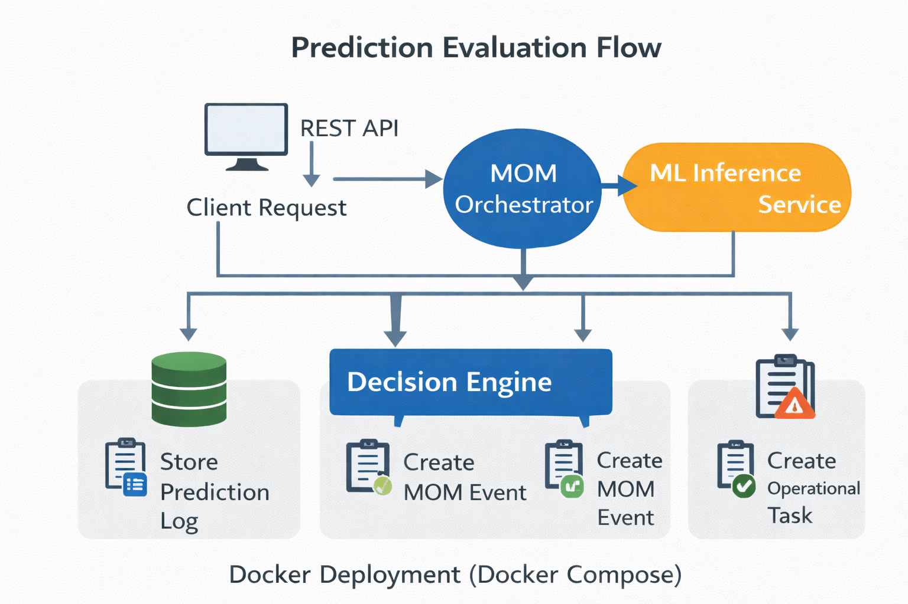
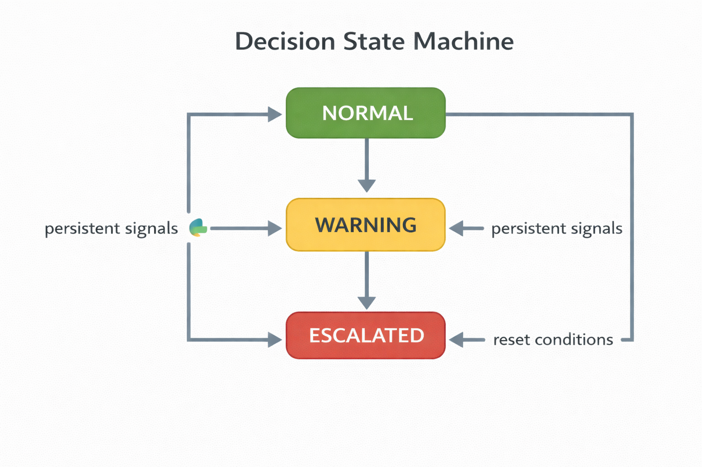
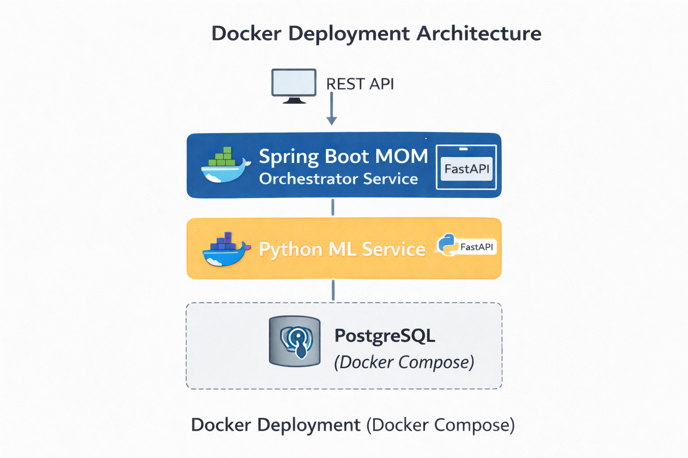

# Predictive Scrap Risk Governance Platform  
### Production-Safe ML Integration for Manufacturing Operations (MOM + ML)


A prototype architecture demonstrating how **machine learning predictions can be safely integrated into manufacturing operations** using a MOM-style orchestration layer.

The platform predicts **scrap risk in advance** and converts model predictions into **controlled operational actions** such as events, alerts, and workflow tasks.

This project demonstrates how machine learning predictions can be integrated safely into industrial MOM environments by introducing governance, traceability, and workflow integration.

---

# Highlights

- Predict scrap risk **20 minutes in advance**
- Integrates **Machine Learning with MOM decision governance**
- Uses **state machine logic to avoid false alarms**
- Generates **operational events and workflow tasks**
- Provides **full prediction traceability and audit logs**
- Fully **containerized architecture (Docker)**

---

# Problem

In manufacturing processes, quality deviations often appear **20–30 minutes before scrap events occur**.

Operators typically detect these issues **too late**, leading to:

- material waste
- machine downtime
- production inefficiency

While machine learning models can predict risk, **raw predictions alone are not safe for production use**.

Industrial environments require additional capabilities:

- controlled decision logic
- traceable operational state
- workflow integration
- fallback mechanisms

This project demonstrates how predictive models can be integrated safely into **Manufacturing Operations Management (MOM)** systems.

---

# Solution

The platform introduces a **governance layer between machine learning predictions and manufacturing operations**.

Instead of directly acting on model outputs, predictions are evaluated by a **Decision Engine** which applies operational logic before triggering actions.

The architecture consists of:

1. **Python ML inference service**
2. **Spring Boot MOM orchestration service**
3. **Decision engine with state machine logic**
4. **PostgreSQL persistence layer**
5. **Docker-based deployment**

The system transforms predictions into **traceable operational outcomes**.

---

# Architecture

The platform follows a **service-oriented architecture** separating prediction, orchestration, and operational persistence.

| Component | Responsibility |
|-----------|----------------|
| **MOM Orchestrator (Spring Boot)** | Evaluates predictions and applies decision governance |
| **ML Inference Service (FastAPI)** | Generates scrap risk probability |
| **Decision Engine** | Applies thresholds, persistency logic, and fallback rules |
| **PostgreSQL** | Stores state, events, tasks, and prediction logs |
| **Swagger / REST API** | Interface for submitting risk evaluation requests |


*Figure: High-level architecture of the predictive MOM governance platform*
---

# System Flow

1. Client submits process features through the API
2. Spring Boot sends the data to the ML inference service
3. Python ML model calculates scrap risk probability
4. DecisionEngine evaluates the prediction using:
   - adaptive thresholds
   - persistency counters
   - data quality checks
5. The system persists:
   - risk state
   - prediction logs
6. If required, the system creates:
   - MOM events
   - operational tasks


---

# Prediction Evaluation Flow

The following diagram shows how prediction requests move through the system and how operational actions are generated.



The flow demonstrates how machine learning predictions are converted into controlled MOM actions:

1. Client sends a risk evaluation request
2. MOM Orchestrator forwards features to the ML inference service
3. The ML model returns scrap risk probability
4. Decision Engine evaluates prediction using operational rules
5. The system stores prediction logs
6. If risk thresholds are exceeded, MOM events or operational tasks are created
---

# Decision Engine Logic

Predictions from the ML service are evaluated by a governance layer before triggering operational actions.



The Decision Engine implements:

- **State machine transitions**
- **Adaptive risk thresholds**
- **Persistency counters**
- **Data quality validation**
- **Fallback behavior**

Example state transitions:
NORMAL → WARNING → ESCALATED


Escalation only occurs when **multiple consecutive risk signals** are detected.

This reduces false alarms caused by noisy sensor data.

---

# Technology Stack

## Backend orchestration
- Java 17
- Spring Boot
- Spring Data JPA

## Machine learning service
- Python
- FastAPI

## Persistence
- PostgreSQL

## Deployment
- Docker
- Docker Compose

## Integration
- REST APIs
- Swagger/OpenAPI

## Architecture patterns
- Decision Engine
- State Machine
- Persistency Counters
- Service-Oriented Architecture


---

# Deployment Architecture

The platform is designed for containerized deployment using Docker Compose.



Deployment includes three main services:

- **MOM Service (Spring Boot)**  
  Handles orchestration, decision engine logic, and REST APIs.

- **ML Inference Service (FastAPI)**  
  Provides machine learning predictions through a REST interface.

- **PostgreSQL Database**  
  Stores system state, prediction logs, events, and tasks.

Docker Compose allows the entire platform to be deployed consistently across environments.
---

# Key Features

### Predictive scrap risk detection
Machine learning predicts potential quality deviations before scrap occurs.

### Adaptive thresholds
Risk thresholds can vary depending on:

- production line
- recipe
- shift

### Decision governance
Predictions are evaluated by a **Decision Engine** before triggering actions.

### Persistency counters
Multiple consecutive signals are required before escalation to reduce false alarms.

### Data quality fallback
If sensor data quality drops below a threshold, the system automatically switches to fallback mode.

### Operational workflow integration
Predictions can trigger:

- production events
- quality inspection tasks
- supervisor approvals

### Full audit logging
All predictions and decisions are stored in a **prediction_log** table for traceability.

### Containerized deployment
The entire system runs using **Docker Compose**.

---

# Database Model

The platform persists operational information using several tables:

| Table | Purpose |
|-------|---------|
| risk_state | Current risk state per production order |
| prediction_log | Audit log of model predictions |
| mom_event | Operational events triggered by risk detection |
| mom_task | Workflow tasks generated by the system |

---

# REST API Example

Endpoint:

`POST /api/v1/risk/evaluate`

Example request:

```json
{
  "requestId": "req-001",
  "timestamp": "2026-03-08T15:00:00Z",
  "plant": "Kastamonu",
  "lineId": "MDF1",
  "horizonMinutes": 20,
  "windowMinutes": 15,
  "context": {
    "shift": "Night",
    "recipe": "18mm_standard",
    "orderId": "WO_1003"
  },
  "features": {
    "moisture_pre_press_avg_5m": 10.0,
    "press_pressure_right_avg_5m": 25.8,
    "glue_ratio_avg_5m": 9.4
  }
}
```
Example response:

```json
{
  "requestId": "req-001",
  "lineId": "MDF1",
  "appliedState": "ESCALATED",
  "probability": 0.82,
  "riskLevel": "HIGH",
  "appliedThreshold": 0.75,
  "fallbackUsed": false,
  "actionsCreated": [
    "CREATE_EVENT",
    "CREATE_QUALITY_TASK"
  ]
}
```
predictive-mom-platform
```
├── mom-service
│   Spring Boot MOM orchestration layer
│
├── ml-service
│   Python FastAPI ML inference service
│
├── docker-compose.yml
│   Container orchestration
│
├── docs
│   Architecture diagrams and case study
│
└── README.md

